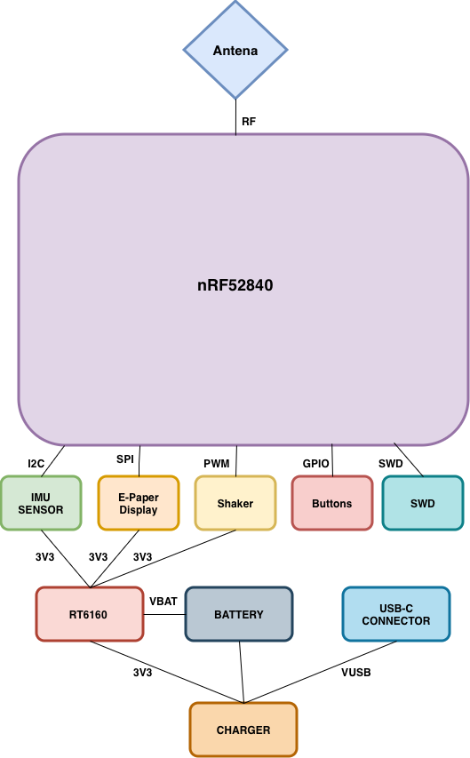
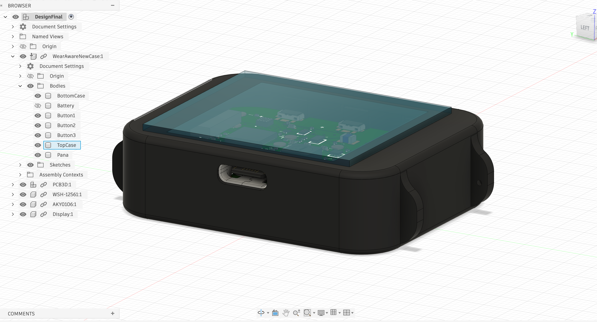
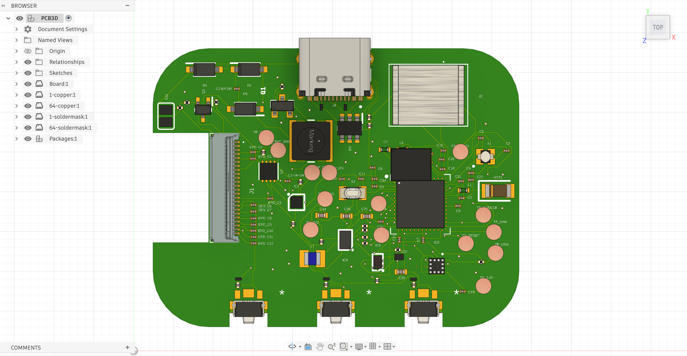
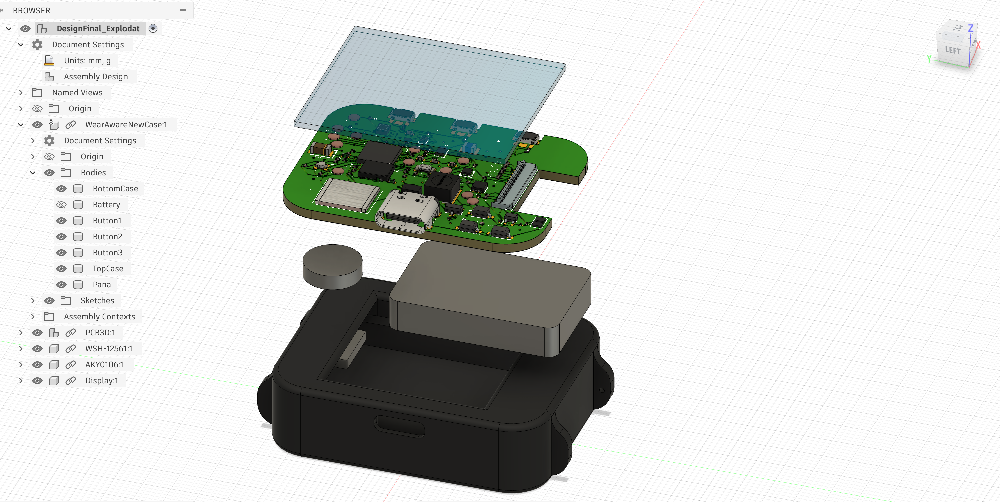

# InkTime Smartwatch

**Author:** Adelina Maria Alexe

**License:** [GNU GPLv3](LICENSE)  

---

## Architecture & Block Diagram

The core architecture relies on the **nRF52840 SoC** to manage all peripheral communication and wireless connectivity. To guarantee system stability and maximize battery utilization, power delivery is strictly regulated by an **RT6160 Buck-Boost converter**, which maintains a constant 3.3V rail for all active components.

**Block Diagram**

---

## Bill of Materials

| Designator(s) | JLC | Package | Description | Referance |
| :--- | :--- | :--- | :--- | :--- |
| **U1** | C3606653 | QFN-48 | nRF52840 BLE 5.4 Microcontroller | [Referance](https://www.lcsc.com/datasheet/C3606653.pdf) |
| **IC1** | C3682423 | DSBGA-8 | BQ25180 Li-Ion/Polymer Charger IC | [Referance](https://www.ti.com/cn/lit/ds/symlink/bq25180.pdf?ts=1775594237116) |
| **IC2** | C81079 | DSBGA-9 | DRV2605 Haptic Motor Driver | [Referance](https://www.ti.com/cn/lit/gpn/drv2605) |
| **IC3** | C189517 | LGA-12 | BMA423 Triaxial Accelerometer (IMU) | [Referance](https://www.lcsc.com/datasheet/C189517.pdf) |
| **IC9** | C7065276 | WLCSP-15B | RT6160 Buck-Boost Regulator | [Referance](https://wmsc.lcsc.com/wmsc/upload/file/pdf/v2/lcsc/2312271436_Richtek-Tech-RT6160AWSC_C7065276.pdf) |
| **U2** | C2682616 | DFN-8-EP | MAX17048G I2C Battery Fuel Gauge | [Referance](https://www.lcsc.com/datasheet/lcsc_datasheet_2410121738_Analog-Devices-Inc--Maxim-Integrated-MAX17048G-T10_C2682616.pdf) |
| **J1** | C122434 | SMD 0.5mm | 24-Pin FPC Connector (E-Paper Display) | [Referance](https://www.molex.com/content/dam/molex/molex-dot-com/products/automated/en-us/salesdrawingpdf/503/503480/5034802400_sd.pdf) |
| **J4** | C709357 | SMD Type-C | Type-C USB 16P Connector | [Referance](https://www.lcsc.com/datasheet/lcsc_datasheet_2404191039_Shenzhen-Kinghelm-Elec-KH-TYPE-C-16P_C709357.pdf) |
| **ANT1** | C2917717 | 1206 | 2.45GHz Patch Antenna (0.5dBi) | [Referance](https://www.lcsc.com/datasheet/lcsc_datasheet_2404021210_Johanson-Dielectrics-2450AT18B100E_C2917717.pdf) |
| **X1** | C9009 | SMD3225 | 32MHz Crystal Oscillator | [Referance](https://www.lcsc.com/datasheet/lcsc_datasheet_2403291504_YXC-Crystal-Oscillators-X322532MOB4SI_C9009.pdf) |
| **X2** | C32346 | SMD3215 | 32.768kHz Crystal Oscillator | [Referance](https://www.lcsc.com/datasheet/lcsc_datasheet_2404180925_Seiko-Epson-Q13FC13500004_C32346.pdf) |
| **SW_UP, SW_ENT, SW_DN** | C569760 | SMD 3.9x2.9 | Tactile Switches (IP67) | [Referance](https://wmsc.lcsc.com/wmsc/upload/file/pdf/v2/lcsc/2301111010_PANASONIC-EVPAKE31A_C569760.pdf) |
| **D2, D4, D5** | C82046 | SOD-123 | MBR0530 Schottky Diode (30V, 0.5A) | [Referance](https://www.lcsc.com/datasheet/lcsc_datasheet_2304140030_onsemi-MBR0530T1G_C82046.pdf) |
| **D3** | C2969755 | SOT-23-6L | USBLC6-2SC6Y ESD Protection Array | [Referance](https://wmsc.lcsc.com/wmsc/upload/file/pdf/v2/lcsc/2211080730_STMicroelectronics-USBLC6-2SC6Y_C2969755.pdf) |
| **Q1** | C2564 | TO-220AB | IRF4905PBF P-Channel MOSFET | [Referance](https://www.lcsc.com/datasheet/lcsc_datasheet_1809041724_Infineon-Technologies-IRF4905PBF_C2564.pdf) |
| **Q3** | C469327 | SOT-323 | Si1308EDL N-Channel MOSFET | [Referance](https://www.lcsc.com/datasheet/lcsc_datasheet_1912202016_Vishay-Intertech-SI1308EDL-T1-GE3_C469327.pdf) |
| **L1, L2, L3** | C12669 | 0402 | Generic Chip Inductor (27nH) | [Referance](https://www.lcsc.com/datasheet/lcsc_datasheet_2304140030_Murata-Electronics-LQG15HS27NJ02D_C12669.pdf) |
| **L5** | C1329646 | SMD 4.8x4.8 | 4.7uH Power Inductor (AEC-Q200) | [Referance](https://wmsc.lcsc.com/wmsc/upload/file/pdf/v2/lcsc/2304140030_BOURNS-SRR4828A-4R7Y_C1329646.pdf) |
| **L7** | C5832368 | 1008 | 470nH Power Inductor | [Referance](https://wmsc.lcsc.com/wmsc/upload/file/pdf/v2/lcsc/2306021632_cjiang--Changjiang-Microelectronics-Tech-FTC252012SR47MBCA_C5832368.pdf) |
| **J2** | C90533 | P=1mm | 6 POS Cable Adapter | [Referance](https://wmsc.lcsc.com/wmsc/upload/file/pdf/v2/lcsc/1810141506_LX-FFC6P1-0mm7CM_C90533.pdf) |
| **Resistors (Group)** | C3920633 | 0201 | 7.68k Thin Film Resistors (±0.5%) | [Referance](https://wmsc.lcsc.com/wmsc/upload/file/pdf/v2/lcsc/2404081048_TE-Connectivity-CPF0201B511RE1_C3920633.pdf) |
| **Capacitors (Group)** | C9900156064 | 0201 | Generic Chip Capacitors | [Referance](https://ds.yuden.co.jp/TYCOMPAS/or/download?pn=MLAST063SCG681JFNA01&fileType=CA) |
| **C23, C27, C34, C42** | C21012218 | - | Special Chip Capacitors | [Referance](https://jlc-prod-smt.oss-eu-central-1.aliyuncs.com/smtDataManualFile/8603520985945550848-C21012218.pdf?response-content-disposition=attachment%3B%20filename%3DC21012218.pdf%3B%20filename%2A%3DUTF-8%27%27C21012218.pdf&x-oss-date=20260407T205848Z&x-oss-expires=1800&x-oss-security-token=CAISgAN1q6Ft5B2yfSjIr5r9Dd2HhJt1xpCRZnzhgHQ0Psp9nrTKiTz2IHhMdHJsAOodtv0%2FmmhT6PkclqRLcbhpcmfjV%2BZHzLB8qYoRtS1%2F4J7b16cNrbH4M4H6aXeirtuwDsz9SNTCALjPD3nPii50x5bjaDymRCbLGJaViJlhHLN1Ow6jdmhpCctxLAlvo9NgFxm3D%2Fu2NQPwiWf9FVdhvhEG6Vly8qOi2MaRmFy8yFTx0b0SvJ%2BjYMrmPctoN9JnSdC5mfdzau3a1TJ84gRD0a5wkaVA1zbDs5bfISEIuUzebreLqY03dV4mOvdqIcMe8qigz88fk%2FfIioH6xyxKOexoSCnFTOiiupCcQLPyao9jLu6iayqViY7QaIOTqQohZmkAMwVOasAsI3Ngh4zF97Qt0cVNkXO9gWfLI8DtuMleWoolCMBMoNHD0eS19jklBdzSlusJRAJJUVBflCeKEaRNSAd3WGhEfM2%2BBt4QT30w5N2u00S8OSMIfXAg5qKWD5sagAGsz%2FZUSUxHdlmxVPmipF%2FTcZWs78wlHh10XRuVSQAFwkjbrT5Hik%2Bt6g43igoBe9p%2FcAdU6beRw%2F0OV8Ul08RsL45K5wTZwHFsbzFcwqB3eAqV0VruhFdx%2FHGC73AK3f%2BS3e6Qh1%2F1xoEQbmetO%2F%2BEcdyt%2BmwKiZrCa5Agq9keuCAA&x-oss-signature-version=OSS4-HMAC-SHA256&x-oss-credential=STS.NYHFg3iDTqRzdZPdta2EQqqak%2F20260407%2Feu-central-1%2Foss%2Faliyun_v4_request&x-oss-signature=20ddec61a1b664f2d44439cb342bbd932d8702b658f2816e0dfb7eb77563430a) |
| **C24, C25, C33, C39** | C9900179830 | 0402 | 0402 Metric Capacitors | N/A |
| **SJ1** | N/A | Copper | Solder Jumper (Leave Open) | N/A |
| **TP** | N/A | Copper | Test Pads | N/A |

---

## Hardware Specifications & Functionality

InkTime is engineered from the ground up for extreme power efficiency. By pairing a deeply optimized microcontroller with an E-Ink display, the device maintains readability in direct sunlight while drawing virtually no power during static image display.

### -> Processing & Connectivity
* **Microcontroller (Nordic nRF52840):** Features an ARM Cortex-M4F core clocked at 64 MHz. It provides native support for Bluetooth 5.4 (BLE) and boasts exceptional deep-sleep currents in the micro-amp range. 

### -> Power Management System
* **Charging Interface:** The **BQ25180** IC handles USB-C battery charging utilizing a strict Constant Current/Constant Voltage (CC/CV) profile, alongside integrated overvoltage and thermal protection.
* **Voltage Regulation:** We opted for the **RT6160** Buck-Boost converter over a standard LDO. This allows the system to maintain a rock-solid **3.3V** output even when the Li-Po battery voltage sags down to 3.0V, squeezing every last drop of usable capacity from the cell.
* **Battery Monitoring:** The **MAX17048G** Fuel Gauge interfaces via I2C to provide high-resolution State of Charge (SoC) metrics without requiring complex shunt resistor calculations.

### -> Peripherals & Busses
* **SPI Bus (Display):** Dedicated entirely to the 1.54" E-Paper display via a 24-pin FPC connector (J1). SPI ensures the high bandwidth needed for screen refreshes without bottlenecking other sensors.
* **I2C Bus (Sensors):** A shared I2C bus routes data from the **BMA423** IMU (used for step counting and wake-on-wrist-raise), the **MAX17048G** fuel gauge, and the **DRV2605YZFR** haptic driver.
* **Haptics:** Silent, localized haptic feedback is generated by a vibration motor driven by the **DRV2605YZFR** via PWM signals from the MCU.

### -> Power Consumption & Autonomy Analysis
The device is powered by a compact **250 mAh Li-Po cell** (Akyga LP502030). Given the E-Ink display's zero-power static state, the system's current draw is highly optimized:

* **Sleep State (MCU + BLE Advertising):** ~35 µA
* **Active Sensor Polling:** ~120 µA
* **Display Refresh Cost (Averaged per minute):** ~25 µA
* **Estimated Average Current (I_avg):** 180 µA (0.18 mA)

**Theoretical Battery Life:** `T = 250 mAh / 0.18 mA ≈ 1389 hours`

Accounting for real-world environmental factors, battery degradation, and dynamic haptic usage, the practical autonomy is rated at **9 to 14 days** per charge.

---

## MCU Pinout & Interface Mapping

| Interface / Component | Signal | nRF52840 Pin | I/O | Engineering Rationale |
| :--- | :--- | :--- | :--- | :--- |
| **E-Ink Display** | SPI SCK | **P0.11** | Output | High-speed clock mapped to Port 0 for EasyDMA access. |
| **E-Ink Display** | SPI MOSI | **P0.12** | Output | Display data transmission. |
| **E-Ink Display** | SPI CS | **P0.13** | Output | Active-low Chip Select. |
| **E-Ink Display** | Data/Command | **P0.14** | Output | Toggles between command modes and payload data. |
| **E-Ink Display** | Reset | **P0.15** | Output | Hardware reset trigger for E-Ink initialization. |
| **E-Ink Display** | Busy | **P0.16** | Input | Halts MCU operations while the display refreshes. |
| **I2C Bus** | SDA | **P0.26** | I/O | Shared data line for IMU, Fuel Gauge, and Haptics. |
| **I2C Bus** | SCL | **P0.27** | Output | Shared clock line optimized for low-power I2C routing. |
| **Button (Up)** | GPIO | **P1.07** | Input | Isolated on Port 1 to prevent high-speed signal noise. |
| **Button (Enter)** | GPIO | **P1.08** | Input | Includes internal pull-up resistor. |
| **Button (Down)** | GPIO | **P1.09** | Input | UI navigation control. |
| **Haptic Motor** | PWM | **P1.02** | Output | Modulates vibration intensity via PWM. |
| **PMIC Control** | DC/DC EN | **P0.18** | Output | Enables/Disables the RT6160 during extreme deep sleep. |
| **IMU Sensor** | INT1 | **P0.25** | Input | Hardware interrupt designated for "double-tap" wake up. |

### Design Justifications:
- **Port Segregation:** Port 0 is strictly allocated to high-speed digital busses (SPI/I2C) to leverage Nordic's **EasyDMA**, offloading data transfer from the CPU. Port 1 is reserved for physical buttons, providing physical layout isolation from high-frequency switching noise, thereby preventing false button triggers (ghosting).
- **SPI Trace Routing:** Pins P0.11 through P0.16 were selected due to their physical grouping on the silicon die, allowing for a tight, length-matched routing channel to the FPC connector.
- **NFC Provisioning:** Pins P0.09 and P0.10 were deliberately left disconnected. Their internal capacitance differs from standard GPIOs due to their native NFC capabilities. Keeping them free leaves the door open for future hardware revisions featuring contactless technology.

---

## PCB Design Log & Decisions

The PCB layout adheres to strict Design for Manufacturing (DFM) tolerances required for high-density wearable electronics:

* **Single-Layer Component Placement:** Due to severe vertical clearance constraints inside the chassis, **all 49 components are mounted on the TOP layer**. The BOTTOM layer is primarily utilized for an unbroken ground plane and non-critical signal routing.
* **Miniaturization (0201 Packages):** To achieve the required routing density on a single layer, all standard passive components (resistors, small capacitors) were downsized to **0201** imperial footprints.
* **Signal Integrity & Decoupling:** **100nF** bypass capacitors are placed aggressively close—within **0.5mm**—to the power pins of the nRF52840 to minimize parasitic loop inductance.
* **Trace Width Constraints:** Power delivery rails (VCC, 3V3, VBAT) are routed at a robust **0.3mm** width to prevent voltage drops during peak current spikes (e.g., haptic motor activation or BLE transmission). Standard data traces are kept at **0.15mm**.
* **RF Optimization (Keep-Out & Stitching):** A strict keep-out zone (void of any copper, traces, or ground planes) was enforced through all PCB layers directly beneath the 2.4GHz chip antenna. Additionally, heavy **via stitching** was applied across the board—particularly around the RF path—to tie the top and bottom ground planes together, drastically lowering reference impedance.

---

## Hardware Renderings & Visuals

**Final Design**

**PCB 3D**

**Final Design Exploded**
